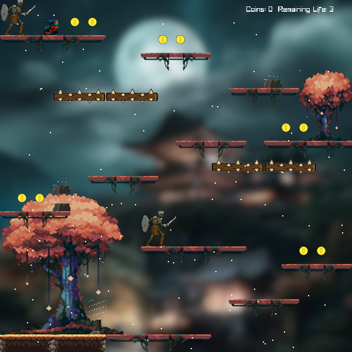

# Cartesia


## Dependencies
- Raylib: https://github.com/raysan5/raylib

## Build Instructions
```sh
cmake -B bin
cmake --build bin
```

## Links to resources used
- Assets: https://anokolisa.itch.io/world-atlas
- Monsters: https://luizmelo.itch.io/monsters-creatures-fantasy
- Coin sound: https://pixabay.com/sound-effects/search/coin/
- Background music: https://www.youtube.com/watch?v=-bktIZ1YiWo
